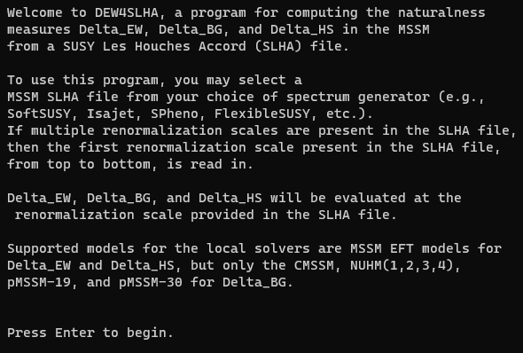
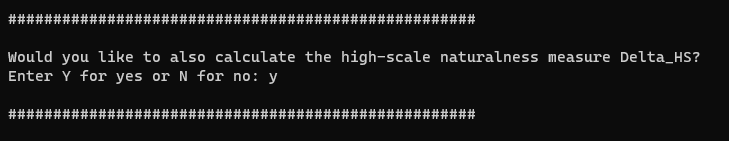
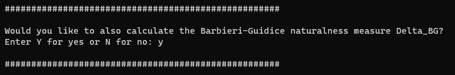
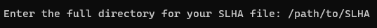
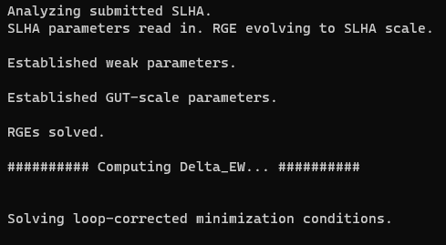
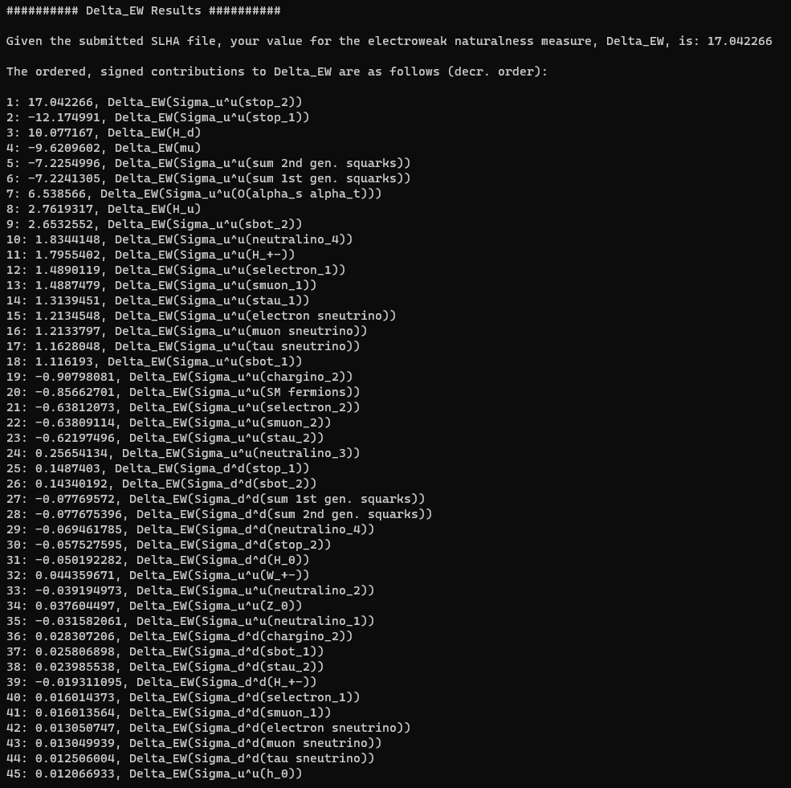
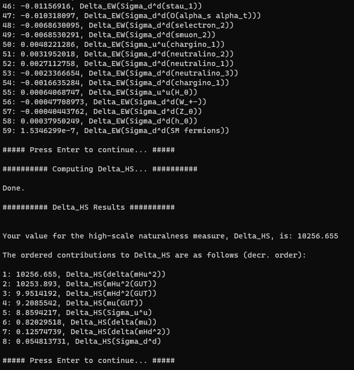
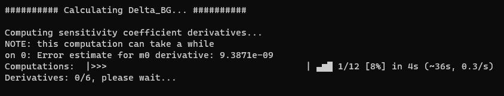
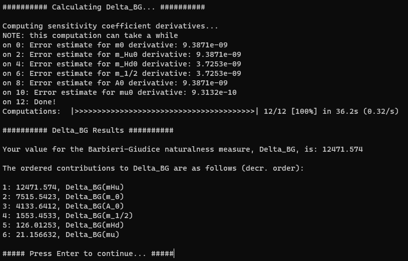
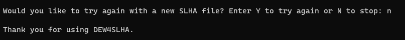

# natLHA

natLHA computes electroweak, high-scale, Barbieri-Giudice, and differential
stringy naturalness measures from SLHA spectra. The current C++ implementation
supports an optional CUDA backend for ordered, large-population scans. CUDA
accelerates both repeated 44-state MSSM RGE integrations and the fused Q_SUSY
evolution/scan/root-refinement stage. Final contribution labels and failure
strings are constructed on the CPU, and tier disagreement or audit mismatch is
CPU-adjudicated.

The historical DEW4SLHA v1.3 documentation follows this current quick start.
For CUDA validation methodology, measured performance, and known boundaries,
see [the CUDA batch validation report](docs/cuda-batch-validation.md).

## Build the current C++ implementation

Run these commands from the repository root. A CPU-only build is the default and
does not require a CUDA installation:

```bash
(
  mkdir -p build/cpu
  cd build/cpu
  cmake ../../natLHA -G Ninja \
    -DNATLHA_STATIC_LINK=OFF -DCMAKE_BUILD_TYPE=Release
  cmake --build .
  ctest --output-on-failure
)
```

The CUDA build requires CMake 3.24 or newer, a CUDA 12.8-or-newer toolkit, and a
supported NVIDIA GPU. First run `/path/to/cuda-12.8-or-newer/bin/nvcc --version`
and substitute that verified compiler path below. Setting it explicitly avoids
accidentally using an older `nvcc` earlier on `PATH`:

```bash
cmake -S natLHA -B build/cuda -G Ninja \
  -DNATLHA_STATIC_LINK=OFF \
  -DNATLHA_ENABLE_CUDA=ON \
  -DCMAKE_CUDA_COMPILER=/path/to/cuda-12.8-or-newer/bin/nvcc \
  -DCMAKE_BUILD_TYPE=Release
cmake --build build/cuda
ctest --test-dir build/cuda --output-on-failure
```

Both builds require Boost, Eigen, MPFR, and GMP development packages. The CUDA
build additionally links Boost.Fiber and Boost.Context for bounded logical-point
scheduling. SLHAea is pinned and vendored under `third_party/slhaea`;
configuration does not download dependencies or rely on a machine-specific
include path.

## Run an ordered batch

Create a text file containing one SLHA path per line, then select a backend:

```bash
build/cuda/natlha-cli \
  --batch spectra.txt \
  --dbg --bg-model 1 --bg-precision 3 \
  --backend cuda \
  --cuda-device 0 \
  --cuda-workers 0 \
  --cuda-batch-size 0 \
  --out results.tsv
```

Input order is preserved in the output. Explicit CPU batches emit and flush each
row incrementally. CUDA and auto batches emit ordered rows only after batch
evaluation completes. Interruption during CUDA/auto evaluation may leave the
already-written header, but it cannot leave a prefix of completed data rows. The
whole input list need not fit on the GPU: natLHA streams independent RGE and
Q_SUSY requests through memory-bounded launch chunks. Point state machines are
lightweight fibers scheduled across no more OS threads than the machine's
reported hardware-thread count, rather than one blocked OS thread per point.
`--cuda-workers` controls the maximum live logical point state machines in a
wave; `--cuda-batch-size` separately caps trajectories in one kernel launch.
Zero asks the backend to choose automatically. On a new machine, start at zero
and sweep both controls while measuring points per second.

Backend behavior is explicit:

- `--backend cpu` uses the established CPU/MPFR path and remains the default.
- `--backend cuda` fails closed if the requested CUDA device is unavailable.
- `--backend auto` uses CUDA when available and otherwise records a CPU fallback.
- `--backend-audit` compares every executed CUDA result with CPU, appends
  execution-tier and adjudication columns, and replaces a mismatching result
  with the CPU result. It is a validation mode, not a performance mode.

For production runs that need execution provenance without comparing every row
to CPU, add `--backend-provenance-out provenance.tsv`. This batch-only option
requires the CUDA or auto backend and writes one ordered sidecar row per input:
whether the backend executed, the selected backend, candidate and final tiers,
the numeric adjudication-reason bitset, whether CPU/MPFR adjudicated the row,
and the SLHA path. It does not enable `--backend-audit` and does not change the
primary result schema. Treat the result table and its provenance sidecar as one
logical artifact; callers are responsible for atomic promotion of the pair.

CUDA candidates near a numerical or branch boundary are retried with device
double-double arithmetic. The full `evaluateBatch` API CPU-adjudicates tier
disagreement and treats exact Delta_BG contribution order as part of its
scientific result contract. The tabular CLI uses the narrower
`evaluateBatchRows` contract: it may retain an independently agreeing
double-double result when ambiguity is confined to lower-ranked Delta_BG
contributions that the row does not emit. Every emitted field, the signed
Delta_BG headline label and ordinal, and the exact-tie ordinal set must still
agree; any other boundary or disagreement is CPU-adjudicated.

---

# DEW4SLHAv1.3
This program computes the naturalness measures $\Delta_{EW}$ (DEW) and produces an ordered list of contributions to DEW from the one-loop and partial two-loop Higgs minimization conditions using the effective potential method and a user-provided input SLHA file from the user's choice of spectrum generator. For versions later than v1.3, the program also computes the naturalness measures $\Delta_{HS}$ and $\Delta_{BG}$ for the user-input SLHA file. This documentation is for v1.3.

The installation instructions and general runtime walkthrough below remain historical v1.3 documentation. The $\Delta_{BG}$ model, numerical-mode, and result-convention paragraphs are updated for the current C++ natLHA implementation.

# Installation
There are two main options for obtaining and running DEW4SLHA. The first is perhaps the simplest: a standalone executable for DEW4SLHA, precompiled into the C language using [Pyinstaller](https://pyinstaller.org/en/stable/). Obtain the file `DEW4SLHAv1_3.tar.gz` or equivalently `DEW4SLHAv1_3.zip` from the GitHub releases (https://github.com/Dmartinez-96/DEW-Calculator/releases/tag/DEW4SLHAv1.3). Put this archive in the desired location for the DEW4SLHA program to live. 

<u>**NOTE**</u>: The DEW4SLHA routine is written nearly exclusively in Python3, specifically Python3.9.16. Installing a Python3 compiler is straightforward on most systems -- however, for the user's convenience, DEW4SLHA is packaged here and should function as a standalone executable together with its supporting source code, independent of whether a system has a Python interpreter installed or not. The tradeoff here is that the file size is rather large, as the compiler for Python is packaged into the executable here, together with all dependencies, so that the user's need for installation is minimized.  

Now unpack this archive. For example, unpacking a `tar.gz` archive with an Ubuntu 22.04 terminal could entail using the command:

`cd /path/containing/DEW4SLHAv1_3.tar.gz/archive/`

`tar -xvzf DEW4SLHAv1_3.tar.gz`

`cd DEW4SLHAv1_3`

Alternatively, if one were to just want the Python scripts for use in their own Python environment, details on packages needed are below. Instead of downloading the large executable, precompiled version, the scripts can be downloaded from [GitHub](https://github.com/Dmartinez-96/DEW-Calculator/releases/tag/DEW4SLHAv1.3) as a tarball or ZIP file from `DEW4SLHAv1_3_py.tar.gz` or `DEW4SLHAv1_3_py.zip`. Click on the type of compressed archive you want to download and download them from here.

## Standalone executable installation (no Python required)
This unpacked archive now contains the two methods by which DEW4SLHAv1.3 can be run. If you are running the standalone executable, installation is complete with the exception of possibly ensuring the system has a C compiler properly installed, such as `gcc`. 

## Pythonic version installation
If instead, you would prefer to use the functionally equivalent Python script, ensure you have Python3 installed on your system (see [the Python website](https://www.python.org/downloads/) for info on how to download and install Python for your system). It is recommended to have Python version $\geq$ 3.9.16.

Using a package manager such as `pip` (or `conda`, though some packages such as `pyslha` are outdated as of June 2023 in the standard `conda` repositories -- `pip` should be used here), ensure you have the following Python packages installed. Below is a table providing the package name, recommended version number, and a link to the information pages for these packages. 

|   **Package**  | **Recommended version** |                   **Links**                       |
|:--------------:|:-----------------------:|:-------------------------------------------------:|
|     `numpy`    |          1.23.0         |       [Source](https://numpy.org/install/)        |
|     `scipy`    |          1.10.0         |       [Source](https://scipy.org/install/)        |
|`alive-progress`|          3.1.4          |[Source](https://github.com/rsalmei/alive-progress)|
|    `mpmath`    |          1.2.1          |           [Source](https://mpmath.org/)           |
|    `pyslha`    |          3.2.5          |    [Source](https://pypi.org/project/pyslha/)     |

Make sure that the Python script compressed archive you downloaded has been extracted. For example, on Ubuntu 22.04 with a `tar.gz` archive, do:

`cd /path/to/where/DEW4SLHAv1_3_py.tar.gz/lives/`

`tar -xvzf DEW4SLHAv1_3_py.tar.gz`

`cd DEW4SLHAv1_3_py`

# Startup Instructions

## Standalone executable
After having extracted the `DEW4SLHAv1_3.tar.gz` file, open bash or a terminal and change directory into the parent folder:

`cd /path/to/DEW4SLHAv1_3/`

Change directory to where the executable file lives:

`cd /path/to/DEW4SLHAv1_3/exe/DEW4SLHAv1_3/`

From here, the user can execute the program:

`./DEW4SLHA.x`

`DEW4SLHA.x` is a wrapper script linking into the relevant, precompiled files in the `.../src/` directory. You may need to grant executable permission to the file. If the last line received a "permission denied" error, you can change the permissions of the file to be executable by the following command, for example:

`chmod +x DEW4SLHA.x`

**IMPORTANT:** Do not change the relative locations or names of files inside the `.../src/` directory.

## Python script
Make sure you are in the folder `/path/to/DEW4SLHAv1_3_py/`. With the proper packages installed, you can run the file `DEW4SLHA.x.py` from your Python compiler in a terminal. For example, if your terminal command for running Python programs is '`python`', then use the following command from a terminal to use DEW4SLHAv1.3:

`python DEW4SLHA.x.py`

`DEW4SLHA.x.py` is a wrapper script that links to the relevant files inside the `.../DEW4SLHAv1_3_py/src/` directory.

**IMPORTANT:** Do not change the relative locations or names of `DEW4SLHA.x.py` nor any of the files in the `DEW4SLHAv1_3_py/src/` directory. 

# Runtime Instructions

Many of the runtime instructions are included on-screen to walk the user through the options in DEW4SLHA. Here is an example using an electroweak natural benchmark point, generated by SoftSUSYv4.1.12, from the NUHM2 (non-universal Higgs mass, 2 extra parameters) model with $m_{0}=5000$ GeV, $m_{1/2}=1200$ GeV, $A_{0}=-8000$ GeV, $m_{\text{top}}=173.2$ GeV, $\mu=200$ GeV, and $m_{A}(\text{pole})=2$ TeV.

Upon first loading DEW4SLHA, either via the executable in the terminal or the Python script in the terminal, you will be met with a screen looking similar to the image below. This provides the user with basic information on DEW4SLHA.



After pressing enter to continue, the user is informed of DEW4SLHA's default calculation of the electroweak fine-tuning measure $\Delta_{EW}$. The user is prompted on whether to include the calculation of the high-scale naturalness measure, $\Delta_{HS}$, as below:



The user is similarly prompted regarding the Barbieri-Giudice naturalness measure $\Delta_{BG}$:



Should the user choose to evaluate $\Delta_{BG}$, further information is required before the computation can proceed. The active natLHA interface offers the CMSSM, NUHM(1,2,3,4), and pMSSM-30 plus $\mu$. The last model has 31 independent directions. The numerical mode is selected separately as described below.

With the configuration complete and successful, the user should next see a screen similar to below, prompting them for the location of their SLHA file.



The path should be included as an absolute path (i.e., `/home/usr/path/to/SLHA/file` or similar), but relative paths from the `DEW4SLHA.x` executable or `DEW4SLHA.x.py` script should work fine, too (e.g., if `mySLHA` file was in the directory `.../DEW4SLHAv1_3/exe/DEW4SLHAv1_3/mySLHAfiles/`, then inputting the path "`mySLHAfiles/mySLHA`" should work if you haven't moved the executable or source files). You will know you were successful upon seeing a screen like below:



The calculation will then proceed on its own accord to evaluate $\Delta_{EW}$, after which an ordered and signed list of results for 59 individual contributions to $\Delta_{EW}$ from greatest to least, like the one below, will be printed onto the screen. The user may wish to take the time to read these results before pressing enter to continue.



Later, this output can be optionally saved to a text file, should the user wish to do so.

If the user chose to also evaluate $\Delta_{HS}$, then a similar process will occur on screen until a list with the eight contributions to $\Delta_{HS}$ from greatest to least, like the one below, will be printed. If the user did not choose to evaluate $\Delta_{HS}$, this step will not occur.



If the user chose to also evaluate $\Delta_{BG}$, then a similar process will occur on screen. The $\Delta_{BG}$ calculations are much more involved numerically than their electroweak or high-scale cousins, so this calculation can be time-intensive. Computation time depends on the model and on the numerical mode. The three modes are:

| Mode | Numerical derivative method | Purpose |
|:----:|:----------------------------|:--------|
| 1 | Fixed 8-point central difference | Diagnostic |
| 2 | Fixed 4-point central difference | Diagnostic |
| 3 | Adaptive 2-point central differences at $h$, $2h$, and $4h$ | Production default |

Adaptive mode moves its three-estimate window outward only when required and therefore has data-dependent work. It accepts a contribution only when the signed estimates agree within $\max(1,0.005\max|C|)$ and the propagated root-bracket uncertainty separately fits within one percent of that tolerance. A failed required root or a direction with no accepted window fails the requested $\Delta_{BG}$ result rather than returning a partial contribution list.

natLHA reports the signed contribution $C_i$ with the largest absolute magnitude, using the lowest fixed direction ordinal for exact magnitude ties. This signed headline intentionally differs from the conventional non-negative definition $\max_i|C_i|$; the contribution list retains the signs needed to distinguish them.

### Operational $Q_{\rm SUSY}$ root contract

The current natLHA setup accepts $Q_{\rm SUSY}$ only when the bounded dense-output trajectory contains exactly one sampled sign-changing or exact root of

$$
\log Q-\frac{1}{4}\left(\log m_{\tilde t_1}^2+\log m_{\tilde t_2}^2\right)=0,
$$

with both running stop mass-squares finite and strictly positive. Adjacent classification nodes are separated by no more than the declared `qSusyMaxDeltaLogQ`; the CLI override is `--qsusy-max-dlogq H`. A finite nonpositive-stop region breaks root continuity without ending the bounded scan. A non-finite derived stop eigenvalue or stop residual is recorded as a numerical boundary and the scan continues through later valid regions to complete its root-count diagnostic, but any recorded numerical boundary makes the search fail closed even if exactly one root was otherwise found. A non-finite input state remains an immediate numerical failure.

The current default $H=0.1$ is a provisional audit candidate, not a frozen production value. Freezing it requires agreement between $H$ and $H/2$ over the complete development population in success status and root count, with accepted roots agreeing in $\log Q$ within the shared ODE tolerance.

Batch runs can add the structured fields needed for that comparison with `--qsusy-audit`. The option leaves the default batch schema unchanged. In audit mode, each row additionally reports whether every root search completed and accepted one root, the final attempt's root count when that attempt reported structured counts, whether every attempted search reported measured counts, the number of root-search attempts, and the accepted $\log Q$ from the final search. An unstructured final search failure uses `Q_SUSY_roots=-1` and `Q_SUSY_scan_complete=0`; that status means search progress is unknown, so missing root-count evidence cannot be mistaken for a measured zero. `Q_SUSY_search_logQ` is meaningful only when `Q_SUSY_search_ok=1` and otherwise uses zero as a gated sentinel.

After each root search, natLHA re-solves $\mu$ and repeats the full-window search until the root and the retuned state jointly satisfy

$$
\left|\log Q_{\rm SUSY}-\frac{1}{4}\left(\log m_{\tilde t_1}^2+\log m_{\tilde t_2}^2\right)\right|
\leq \max(\epsilon_{\rm ODE,abs},\epsilon_{\rm ODE,rel}).
$$

This is an operational uniqueness definition at a declared sampling resolution. It does not claim to detect tangent or even-multiplicity roots between classification nodes. The sub-step states come from the ODE solver's dense-output interpolant, so the $H$ versus $H/2$ comparison measures stability of that sampled construction rather than independently bounding interpolation error relative to the true trajectory.



After the computations are complete, a list with the various contributions to $\Delta_{BG}$ from greatest to least, like the one below, will be printed. If the user did not choose to evaluate $\Delta_{BG}$, these relevant step will not occur.



The user is then prompted on whether to save their results, as well as the naming scheme by which they would like to save their results. The default filename format is `current_system_time_Dxx_contrib_list.txt`, where "`xx`" is "`EW`", "`HS`", or "`BG`" as suggested by the corresponding prompts. The program will generate an output folder if one does not exist and tell the user where their results may be found.

Lastly, the user can either choose to try again with a new SLHA file from the beginning or quit the program altogether.



# FURTHER INSTRUCTIONS AND INFORMATION CAN BE FOUND AT [dew4slha.com](https://dew4slha.com/).

## Acknowledgments

This software makes use of several third-party libraries:

- **Boost Libraries** (Boost Software License 1.0): [Boost website](https://www.boost.org/).
  CUDA dense-output and TOMS748 adaptations retain their notices and full license
  under `third_party/boost-derived`.
- **SLHAea** (Boost Software License 1.0), pinned under `third_party/slhaea`.
- **Eigen Libraries** (MPL 2.0, with LGPL-2.1+/MPL-2 and BSD-3-Clause terms
  applying to identified files in the distribution): [Eigen website](https://eigen.tuxfamily.org/)

Special thanks to the developers of these libraries for their invaluable contributions to the open source community.
